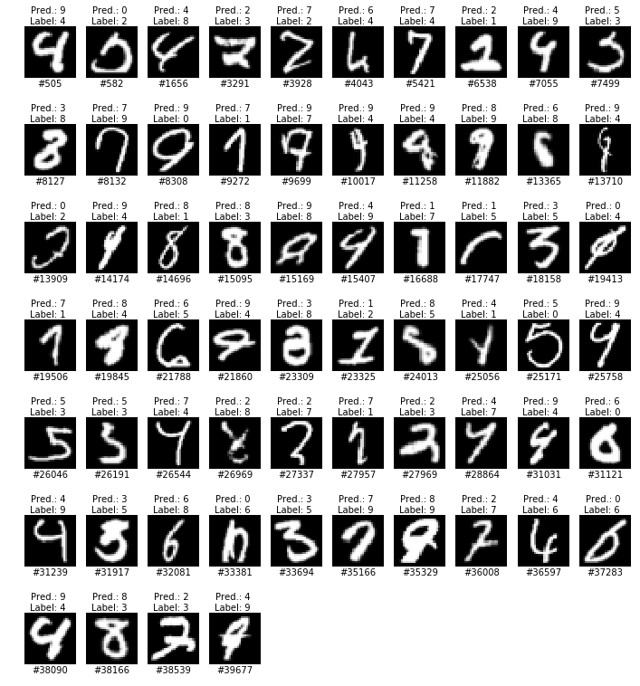
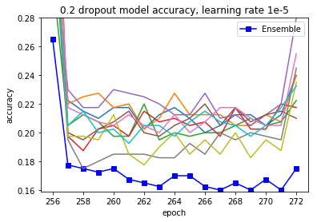
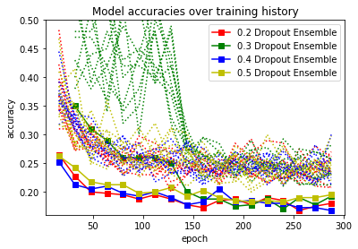
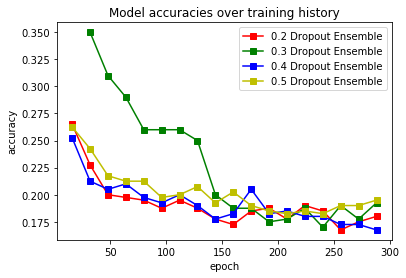

# Classify EMNIST Digits using Convolutional Neural Networks
EMNIST (Cohen, G., Afshar, S., Tapson, J. and van Schaik, A., 2017. [EMNIST: an extension of MNIST to handwritten letters.]( https://arxiv.org/abs/1702.05373)) Digits dataset downloaded from https://www.nist.gov/itl/iad/image-group/emnist-dataset (Matlab format dataset). The Matlab format dataset can be conveniently imported with scipy.io.loadmat.

All models have been trained from scratch on EMNIST Digits training data using realtime data augmentation. All test error rates in percent. All results were obtained with Keras using the Theano backend. Source code resides in https://github.com/j05t/emnist/blob/master/emnist.ipynb, a slightly adapted (and more recent) version using the TensorFlow backend is available at https://github.com/j05t/emnist/blob/master/emnist_tensorflow.ipynb. See https://github.com/j05t/emnist/blob/master/setup.txt for information regarding setup and usage. Detailed results can be viewed at https://github.com/j05t/emnist/blob/master/plot_history/plot_csv.ipynb. Best model weights have been uploaded. 

A JSON/H5 export for the best single model has been uploaded into export_json_h5 directory. The input normalization function for this exported model has hard coded values for image mean and standard deviation based on EMNIST Digits training data.
# Test error rates of this model on EMNIST Digits test data:
0.16% test error rate gives us a total of 64 incorrect predictions on the EMNIST Digits testing dataset of 40,000 images:

## Results for manually set fixed learning rates:
The most promising previously trained models have been loaded, further training was done with a fixed learning rate. Setting the learning rate manually __improved__ the __test error rate of 0.1675%__ attained by training with automatic learning rate adaption __to a test error rate of 0.16%__. This makes for an improvement of __three additional correct predictions__. Further improvements seem unlikely with this model.
### Dropout 0.2

Loaded 256 epoch models, learning rate set to 1e-5. The plot above shows the training history with manual learning rate  from epoch 257 to epoch 271. Accuracies for epochs 256 and 272 which have been achieved with automatic learning rate adaption have been added for comparison.
* 0.16% test error rate with ensemble of 10 CNNs at 267 epochs (dropout_0.2/weights/267epochs_weights_model_?.pkl)
* 0.175% test error rate for best single model at 258 epochs (dropout_0.2/weights/258epochs_weights_model_7.pkl)

## Results with automatic learning rate adaption:

### Dropout 0.2
* 0.1675% test error rate with ensemble of 10 CNNs after 256 epochs
* 0.20% test error rate for best single model after 128 epochs

### Dropout 0.3
* 0.17% test error rate with ensemble of 10 CNNs after 240 epochs
* 0.20% test error rate for best single model after 241 epochs

### Dropout 0.4
* 0.1675% test error rate with ensemble of 10 CNNs after 288 epochs
* 0.21% test error rate for best single model after 272 epochs

### Dropout 0.5
* 0.1825% test error rate with ensemble of 10 CNNs after 208 epochs
* 0.21% test error rate for best single model after 144 epochs
